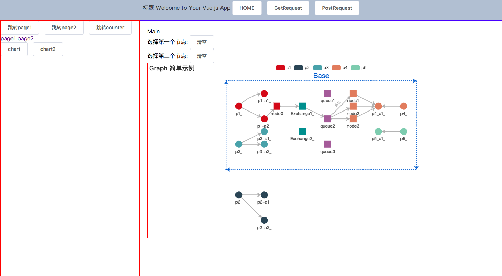
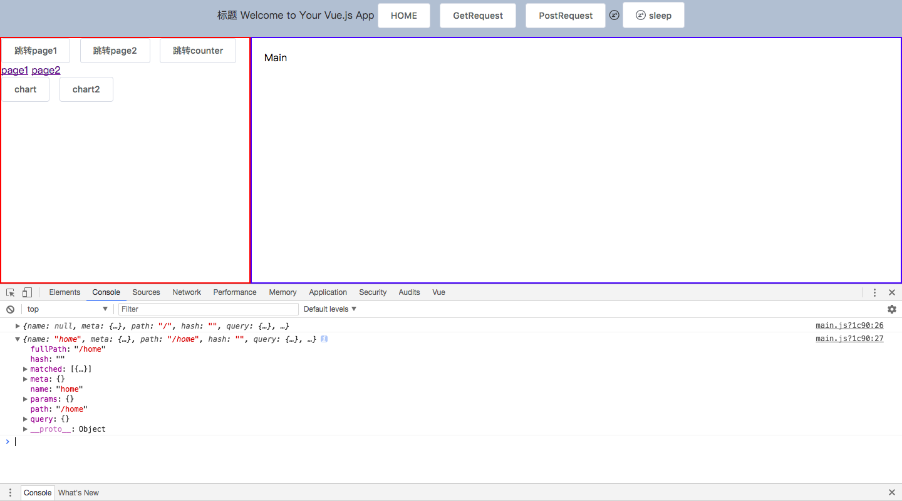
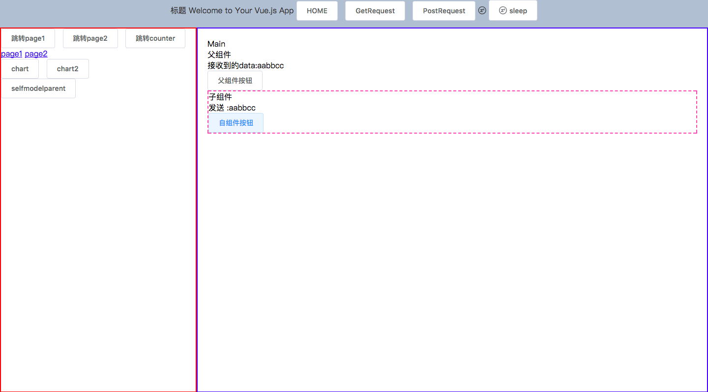
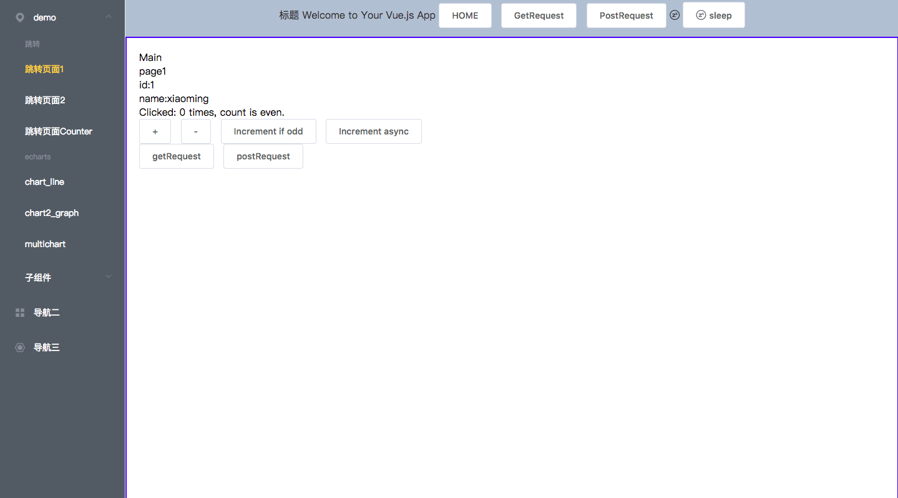

# board

> A Vue.js project

## Build Setup

``` bash
# install dependencies
npm install

# serve with hot reload at localhost:8080
npm run dev

# build for production with minification
npm run build

# build for production and view the bundle analyzer report
npm run build --report
```

# vue 模板
## 参考网址：http://element-cn.eleme.io/#/zh-CN
## 安装dev toolshttp://blog.csdn.net/sinat_17775997/article/details/70224280

# vue路由传参数
``` bash
# this.$router.push({path:'/xxx',query:{id:1}});//类似get传参，通过URL传递参数
# //由于动态路由也是传递params的，所以在 this.$router.push() 方法中 path不能和params一起使用，否则params将无效。需要用name来指定页面。
# this.$router.push({name:'page2',params:{id:1}});//类似post传参
```
# vue路由接收参数
``` bash
## this.$route.query.id
## this.$route.params.id
```

# 路由跳转刷新问题
``` bash
watch: {
      '$route'(to, from){
        //在这里重新刷新一下
        this.getParams();
      }
    }
```

# 引入axios
## 参考文档：https://www.npmjs.com/package/axios
## 参考文档：http://blog.csdn.net/wild46cat/article/details/78447467
``` bash
## npm install axios --save
import axios from 'axios'
```
# 引入echart
## 参考文档：http://blog.csdn.net/u013069892/article/details/70256596
## 参考文档：http://echarts.baidu.com/tutorial.html#ECharts%20%E4%B8%AD%E7%9A%84%E4%BA%8B%E4%BB%B6%E5%92%8C%E8%A1%8C%E4%B8%BA
## 参考文档：http://echarts.baidu.com/option.html#title
``` bash
## npm install echarts --save
import echarts from 'echarts'
Vue.prototype.$echarts=echarts

```

# 版本model-v0.0.1


# 版本model-v0.0.2
## 添加了vuex组件


# 版本model-v0.0.3
## 添加vuex对多个模块的支持


# 版本model-v0.0.4
## 添加axios(vuex集成、普通方式)支持，能够与后台交互


# 版本model-v0.0.5
## 添加echart


# 版本model-v0.0.6
## 一个简单的echart关系图的例子demo


# 版本model-v0.0.7
## 对关系图进行完善，一个更强大的关系图(可以参考echart的官方手册http://echarts.baidu.com/option.html#title)


# 版本model-v0.0.8
## 添加全局路由监控功能，引入iconfont图标



# 版本model-v0.0.9
## ecahrt图添加点击高亮功能 添加子组件功能（自定义标签）



# 版本model-v0.1.0
## 添加菜单 优化图界面

